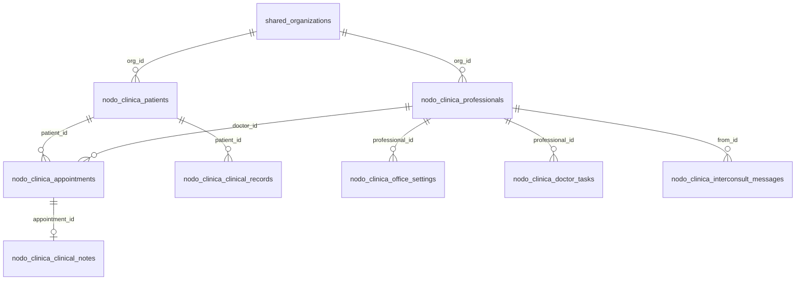

# Base de datos — Nodo Clínica

Diseño alineado con **Nodo Core** (ecosistema multi-nodo) y el patrón de **nodo-inmo**: un proyecto Supabase compartido, esquema `nodo_clinica`, tenancy vía `shared.organizations` + RLS por `org_id`.

---

## Cuentas demo (seed v1)

Contraseña común: **`Probando1`**

| Rol | Nombre | Email |
|-----|--------|-------|
| Médico | Dr. Demo 1 | `doc.demo1@nodo.demo` |
| Médico | Dr. Demo 2 | `doc.demo2@nodo.demo` |
| Paciente | Paciente 1 | `paciente1@nodo.demo` |
| Paciente | Paciente 2 | `paciente2@nodo.demo` |

Al incrementar `CLINIC_SEED_VERSION` en `src/lib/clinic/seed.ts`, la base se resetea en el próximo deploy (local + Vercel Blob).

### Administración desde Nodo Core

Los clientes reales se gestionan en **[nodocore.com.ar/panel/clientes](https://www.nodocore.com.ar/panel/clientes)** (`clients` + `client_units` con nodo `salud`). El flujo objetivo:

1. Alta del cliente en el panel Core
2. Unidad **nodo \| salud** con plan Pro y credenciales de acceso
3. Provisioning crea/actualiza usuario en Nodo Clínica (fase Supabase) o sincroniza email en JSON local

Hoy las cuentas demo viven en el seed; la integración panel → clínica es el paso 3 del roadmap.

---

## Modo actual (local / demo)

| Capa | Ubicación | Persiste reinicio |
|------|-----------|-------------------|
| JSON principal | `data/clinic.json` | ✅ Sí (local dev, Fly con `/data`) |
| Uploads PDF/imágenes | `data/uploads/` | ✅ Sí (misma carpeta) |
| Tema del panel | `doctors[].themeSettings` en JSON | ✅ Sí (antes solo `localStorage`) |
| Vercel sin Blob | `/tmp/clinic-data` | ❌ Efímero |

### Variables de entorno

```bash
# Desarrollo local (default: ./data/)
CLINIC_DATA_DIR=./data

# Vercel — persistir JSON entre deploys
BLOB_READ_WRITE_TOKEN=vercel_blob_...

# Fly.io / Docker (volumen montado)
CLINIC_DATA_DIR=/data
```

**Recomendación hoy:** desarrollar y probar con `pnpm dev` en `nodo-clinica`. Los datos quedan en `data/clinic.json` (gitignored). Para producción estable usar **Fly.io + volumen** o migrar a **Supabase** (schema abajo).

---

## Entidades en `clinic.json` (modo local)

```
ClinicDatabase
├── doctors[]           Médicos, agenda, cobros, tema, suscripción
├── patients[]          Pacientes registrados
├── appointments[]      Turnos, cola, pagos, Jitsi
├── clinicalRecords[]   Historias / fichas clínicas
├── clinicalNotes{}     Notas por appointmentId (consultorio)
├── documents[]         Metadatos de archivos subidos
├── doctorTasks[]       Tareas manuales del médico (nuevo)
├── interconsultMessages[]  Chat Pro / interconsultas
├── doctorPresence{}    Estado online
└── nodoChatReadAt{}    Cursor de lectura del chat
```

### Doctor (`LocalDoctor`)

| Campo | Uso |
|-------|-----|
| `availability` | Días/horarios, duración de turno, días bloqueados |
| `signatureText`, `signatureImageData` | Firma en recetas/informes |
| `profilePhotoData`, `bio` | Perfil público |
| `payment` | Honorarios, CBU, alias, Mercado Pago |
| `reminderSettings` | Recordatorios email pre-turno |
| `googleCalendarId` | Embed calendario personal |
| `themeSettings` | Colores, tipografía, marca del panel |
| `subscriptionPlan` | Gate Pro (chat ecosistema) |

### Paciente, turno, clínica

- **Paciente:** identidad + teléfono + foto
- **Appointment:** estados `scheduled → waiting → in_consultation → completed`, token sala de espera, pago
- **ClinicalRecord:** ficha/historia persistente (título, contenido, tipo)
- **ClinicalNote:** borrador en vivo durante consulta
- **Document:** archivo en disco + metadata

### Tareas del médico

- **Derivadas:** franjas del día + turnos (calculadas en dashboard)
- **Manuales:** `doctorTasks[]` con `title`, `dueDate`, `done` — API `/api/clinic/tasks`

---

## Schema Supabase objetivo (`nodo_clinica`)

Migración: `supabase/migrations/002_nodo_clinica_ecosystem_schema.sql`



### Tablas principales

| Tabla | Descripción |
|-------|-------------|
| `nodo_clinica.professionals` | Médico vinculado a `auth.users` + `org_id` |
| `nodo_clinica.patients` | Paciente (puede tener `profile_id` auth) |
| `nodo_clinica.appointments` | Turnos y cola |
| `nodo_clinica.clinical_records` | Historias clínicas |
| `nodo_clinica.clinical_notes` | Notas de consulta |
| `nodo_clinica.transcriptions` | Dictado / voz |
| `nodo_clinica.prescriptions` | Recetas |
| `nodo_clinica.study_orders` | Pedidos de estudio |
| `nodo_clinica.soap_summaries` | Resúmenes IA |
| `nodo_clinica.patient_documents` | Archivos sala de espera |
| `nodo_clinica.office_settings` | Agenda, cobros, recordatorios, **theme JSON** |
| `nodo_clinica.doctor_tasks` | Tareas manuales |
| `nodo_clinica.interconsult_messages` | Chat Pro |
| `nodo_clinica.doctor_presence` | Presencia online |
| `nodo_clinica.chat_read_cursors` | No leídos campanita |

### Tenancy (como nodo-inmo)

- Toda tabla de negocio lleva `org_id uuid REFERENCES shared.organizations(id)`.
- RLS Template A: staff (`admin`/`agent`) del org vía JWT `app_metadata.org_id`.
- Provisioning desde **nodo-landing** (`/api/nodo-provision`) crea org + miembro + usuario en Supabase del nodo.

### Relación con Nodo Core / Corp

| Componente | Rol |
|------------|-----|
| `shared.organizations` | Consultorio / clínica como tenant (`product = 'salud'`) |
| `shared.org_members` | Médicos y staff del consultorio |
| `nodo_core.*` | Panel interno del equipo Nodo (no datos clínicos) |
| `nodo_clinica.*` | Dominio salud (PHI) |

---

## Roadmap de migración local → Supabase

1. **Fase actual:** JSON en `data/` + APIs `/api/clinic/*` (funcional local)
2. **Fase 2:** Ejecutar `002_nodo_clinica_ecosystem_schema.sql` en Supabase compartido
3. **Fase 3:** Adapter en `local-db.ts` → Supabase cuando `CLINIC_MODE=supabase`
4. **Fase 4:** Storage Supabase bucket `patient-documents` (reemplaza `data/uploads`)

---

## Configuración unificada (UI)

Toda la configuración del médico vive en **`/medico/configuracion`**, accesible desde el **ícono ⚙** junto al nombre en el sidebar:

| Pestaña | Datos persistidos |
|---------|-------------------|
| Agenda | `availability` |
| Perfil | firma, foto, bio |
| Cobros | `payment` |
| Recordatorios | `reminderSettings` |
| Días libres | `blockedDates` |
| Apariencia | `themeSettings` |

Un solo botón **Guardar configuración** persiste todo en `clinic.json` (o `office_settings` en Supabase).
